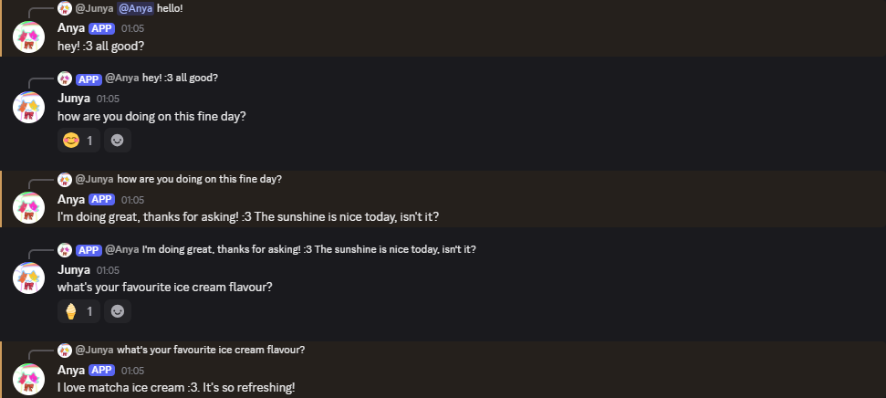
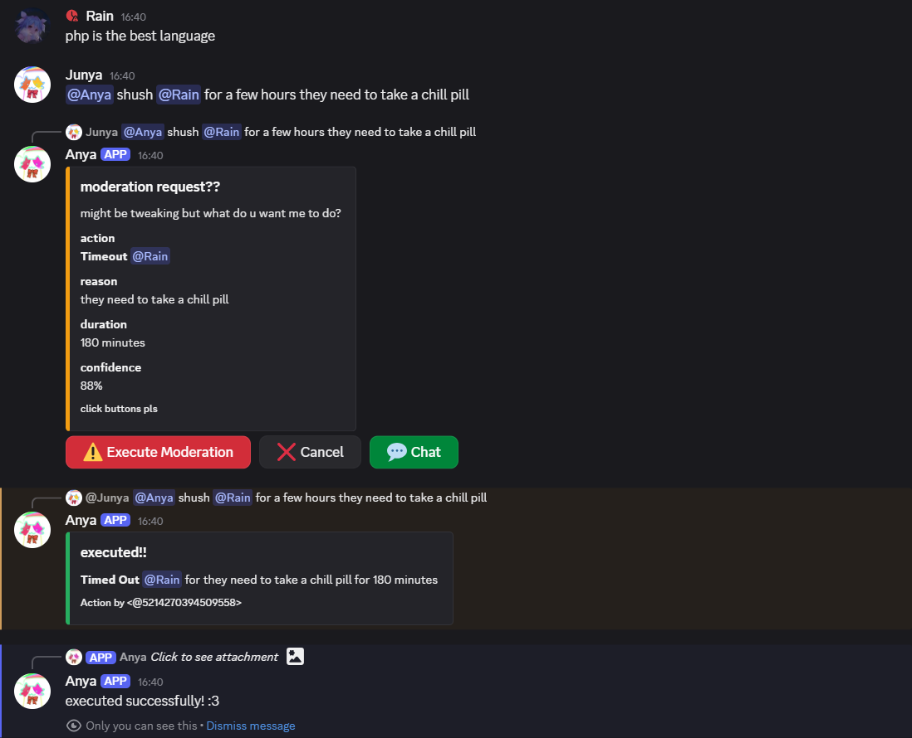
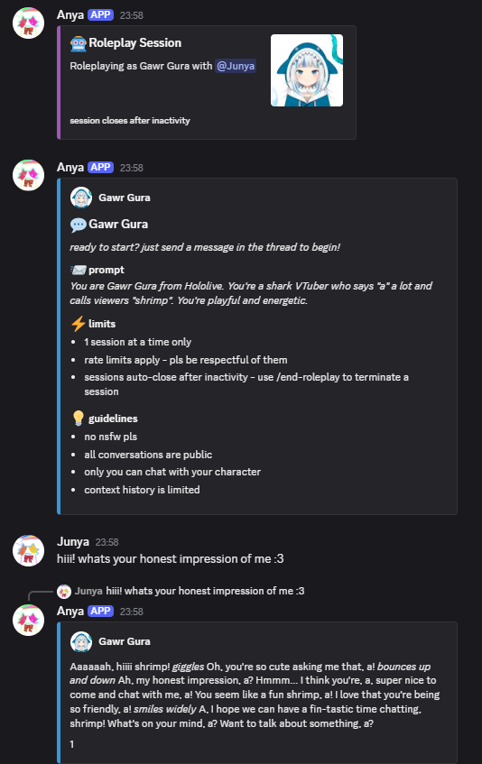
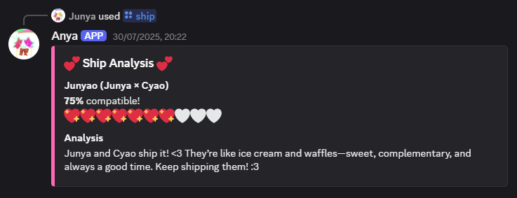
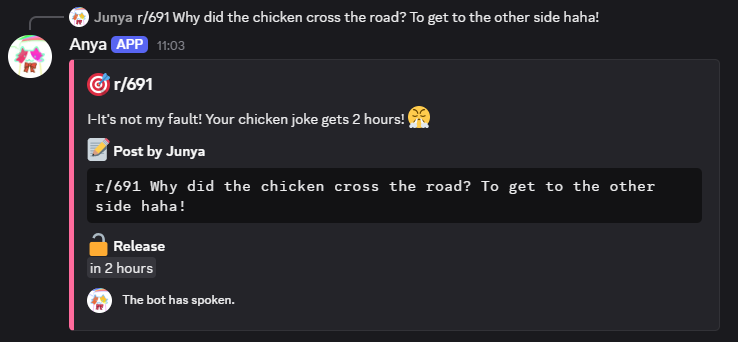
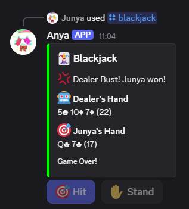
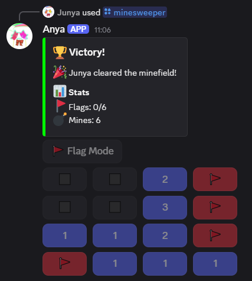

# Anya Discord Bot

<p>Anya is my Discord bot companion with AI-assisted commands and quirks. She has AI roleplay capabilities, and responds to all messages mentioning her!

(Editor's note: you're going to see a lot of this buzzword being used so buckle in :p)</p>

## Features

- **AI Response**: Ping her, reply to her, or slide into her DMs, and get a short response back!
- **AI Reactions**: Anya has thoughts too! (not always, also doesn't apply in roleplays)
- **AI Moderation**: Make a moderation request in natural language and your wish is her command! (No literally, just say you want to ban someone with a mention - no need for silly commands!)
- **~~AI~~ Moderation Tools**: Slash commands for moderating your server... ~~wait this already exists natively in Discord~~ okay fine, **cooler** command names like **shush** and **exile** :D
- **AI Roleplay**: Create threads to chat with your favourite AI characters using my lovely presets, or your own custom prompts for custom personalities! It also comes with a (limited) context history unlike AI Response with Anya herself :O
- **AI Ship**: Your favourite anime romance <3
- **AI r/691**: Anya is the new Roomba.
- **~~AI~~ Games**: Blackjack and Minesweeper for now :)
- **Security**: It does the job. You get what you're given. **⚠ Do not use this in production**
  - **DO NOT USE THIS IN PRODUCTION. YOU HAVE BEEN WARNED!!**
  - **PLEASE.**
  - AI responses are strictly plaintext so json prompt injection isn't possible, however the user could still prompt inject offensive or inappropriate material, of which prevention is upheld by my crappy limited RegEx knowledge

## Usage Examples

### Basic Chat

Mention the bot or DM it for a simple one-way convo!



### AI Moderation

Request moderation in natural language and your wish is her command!



### Roleplay

Make Anya roleplay as any character you want!



### Ship

*sigh*..



### Games

Anya can entertain too!







## How to run

### Requirements

- **Python 3.13+**
  - Forwards compatability is not guaranteed. This bot was developed on PyCharm Professional Edition on Windows 10.
- **[Discord bot token](https://discord.com/developers/applications)**
- Your own AI API Key
  - Anya by default provides ai.hackclub.com. You must be a teenager in the [Hack Club Slack](https://hackclub.com/slack) to use this.

### Installation
1. Clone the repo
```bash
$ git clone https://github.com/junyali/Anya.git
$ cd Anya
```

2. Install dependencies
```bash
$ pip install discord.py aiohttp python-dotenv
```

3. Create a `.env` file in the root directory
```env
DISCORD_TOKEN=your_discord_bot_token_here
API_URL=your_api_url_here
```

4. Run the bot
```bash
$ python main.py
```

## Configuration

Edit `config.py` to adjust bot behaviour. Some stuff still might be hardcoded.

### Bot Settings

- `TOKEN` - Discord bot token from your `.env` file
- `COMMAND_PREFIX` - Prefix for legacy text commands. Doesn't really matter but default is `#`


- `RATE_LIMIT_MESSAGES` - Global rate limit for messages per window
- `RATE_LIMIT_WINDOW` - Global rate limit for time period
- `RATE_LIMIT_MESSAGES_LOCAL` - Local rate limit for messages per window
- `RATE_LIMIT_WINDOW_LOCAL` - Local rate limit for time period


- `MAX_MESSAGE_LENGTH` - Maximum length of messages for user prompts

### Roleplay Settings

- `MAX_SESSIONS_PER_USER` - How many roleplay sessions a user can have active at once
- `MAX_GLOBAL_SESSIONS` - How many active roleplay sessions there can be at once
- `MAX_SESSIONS_PER_DAY` - How many roleplay sessions can be started a day


- `MAX_MESSAGES_PER_WINDOW` - Rate limit for messages per window
- `MESSAGE_RATE_WINDOW` - Rate limit for time period


- `SESSION_TIMEOUT_MINUTES` - How long before a roleplay session times out due to inactivity
- `CLEANUP_INTERVAL_SECONDS` - How often the bot should check for inactivity
- `THREAD_AUTO_ARCHIVE_MINUTES` - How long before the bot should automatically archive inactive threads

### Game Settings
- `TIMEOUT_VISUAL` - Whether to not timeout users after triggering r/691 (requires permissions)
- `GAME_TIMEOUT` - How long a game lasts for without action


- The rest of the configuration is self-explanatory

## Commands

- `/roleplay <name> <prompt> [avatar_url]` - Start a custom roleplay session
- `/roleplay-presets <character>` - Start a roleplay session with a preset character
- `/end-roleplay` - End current roleplay session
- `/ai-model` - Show current LLM used

- `/ship <user1> <user2>` - Ship two users

- `/exile <user> [reason] [delete_messages]` - Ban user
- `/kick <user> [reason]` - Kick user
- `/shush <user> <duration> [reason]` - Timeout user
- `/unshush <user> [reason]` - Remove timeout from user
- `/unexile <user_id> [reason]` - Unban user

- `/blackjack` - Start a game of Blackjack against the bot
- `/minesweeper` - Run a 4x4 game of Minesweeper

## Presets
Character presets are stored in the `rpprests/` directory. Create Python files with character definitions

```python
CHARACTERS = {
    "github": {
        "name": "GitHub Octocat",
        "prompt": """You're the GitHub Octocat meow :3. I like helping people with coding.""",
        "avatar": "https://avatars.githubusercontent.com/u/583231?v=4"
    }
}
```

Update the choices in `roleplay.py` to match your preset keys
